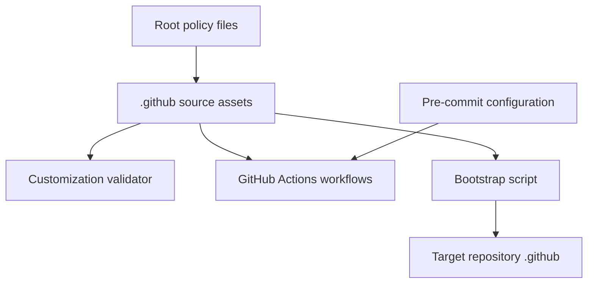

# Architecture

## 1. Purpose

This document describes the repository structure and current behavior evidenced by the worktree. The active evidence is repository governance and Copilot customization; the Git-tracked `IDVH` implementation tree is currently absent from the worktree and is treated as unresolved rather than active architecture.

## 2. System overview

The root policy files define how agents work in this repository.
The `.github` directory holds Copilot source assets and GitHub automation.
The scripts provide bootstrap and validation entrypoints.
The workflows run repository checks in GitHub Actions.
The pre-commit configuration defines local and CI hook coverage.
The `docs/agents` files declare the local knowledge layout and agent-facing guidance.

The diagram shows current file and execution relationships; it does not assert that the absent `IDVH` tree is still an active consumer.

## 3. Current vs intended architecture

| Area | Current architecture | Intended architecture | Status | Evidence |
| --- | --- | --- | --- | --- |
| Repository knowledge | Root README is empty; agent guidance declares a single root context and repository-wide ADRs. | Maintain a single root context with architecture, rules, and decisions that describe present evidence. | Authorized by the bootstrap request | [README.md](../README.md), [docs/agents/domain.md](agents/domain.md) |
| Copilot source assets | `.github` contains instructions, scripts, workflows, and repository metadata. | Keep source-managed assets under `.github` and validate them through the existing entrypoints. | Evidenced | [.github/README.md](../.github/README.md), [.github/scripts/validate-copilot-customizations.sh](../.github/scripts/validate-copilot-customizations.sh) |
| Infrastructure modules | No Terraform source is currently present on disk. | Not specified by current on-disk evidence. | Unknown / To verify | [.pre-commit-config.yaml](../.pre-commit-config.yaml), current worktree status |

## 4. Technology stack

| Area | Technology | Status | Evidence |
| --- | --- | --- | --- |
| Documentation | Markdown | Evidenced | [README.md](../README.md), [docs/agents/domain.md](agents/domain.md) |
| Repository automation | Bash and GitHub Actions | Evidenced | [.github/scripts](../.github/scripts/README.md), [.github/workflows](../.github/workflows/_pre-commit.yml) |
| Validation configuration | pre-commit | Evidenced | [.pre-commit-config.yaml](../.pre-commit-config.yaml) |
| Terraform tooling | Terraform hooks and version selection are configured; source is absent in the current worktree. | Partially evidenced | [.pre-commit-config.yaml](../.pre-commit-config.yaml), [.terraform-version](../.terraform-version) |

## 5. Repository map

| Path | Responsibility | Notes |
| --- | --- | --- |
| `AGENTS.md` | Portable agent operating baseline | Applies before repository-specific instructions. |
| `AGENTS.local.md` | Local policy and repository role | Declares the standards-repository scope and docs placement. |
| `.github/` | Copilot source assets and GitHub automation | Contains instructions, scripts, workflows, and metadata. |
| `.github/scripts/` | Bootstrap and customization validation commands | Owns two shell entrypoints. |
| `.github/workflows/` | CI workflow definitions | Current workflows cover pre-commit and PR title validation. |
| `docs/agents/` | Agent-facing documentation guidance | Declares the single-context layout. |
| `.pre-commit-config.yaml` | Hook and validation configuration | Includes pinned repositories and Terraform hook settings. |

## 6. Architectural boundaries

- **Root policy to source assets**: `.github` is the source location for the Copilot assets described by the local policy. Status: Evidenced by [AGENTS.local.md](../AGENTS.local.md) and [.github/README.md](../.github/README.md).
- **Source assets to target repository**: the bootstrap script reads a source `.github` directory and synchronizes into a target repository `.github` directory. Status: Evidenced by [.github/scripts/bootstrap-copilot-config.sh](../.github/scripts/bootstrap-copilot-config.sh).
- **Repository to GitHub Actions**: workflows execute repository validation in GitHub-hosted runners. Status: Evidenced by [.github/workflows/_pre-commit.yml](../.github/workflows/_pre-commit.yml) and [.github/workflows/_pr-title.yml](../.github/workflows/_pr-title.yml).
- **Repository to external systems**: no runtime service, AWS account, or deployed target is evidenced in the current worktree. Status: Unknown / To verify.

## 7. Dependency rules

### Allowed direction

- Root agent policy may constrain repository documentation and customization changes, as evidenced by [AGENTS.md](../AGENTS.md).
- `.github` scripts may read their local configuration and synchronize to an explicitly supplied target, as evidenced by [bootstrap-copilot-config.sh](../.github/scripts/bootstrap-copilot-config.sh).
- Workflows may invoke the repository's configured validation tooling, as evidenced by [_pre-commit.yml](../.github/workflows/_pre-commit.yml).

### Avoid / forbidden

- Do not treat deleted or absent implementation paths as current dependencies.
- Do not add new frameworks or cross-cutting refactors without explicit approval, as required by [AGENTS.md](../AGENTS.md).
- Do not expand documentation writes into policy, workflow, validator, or source changes during knowledge maintenance.

## 8. Key flows

### Build/test flow

The configured pre-commit hooks validate repository hygiene, YAML/JSON syntax, shell scripts, Python files, Terraform configuration, and workflow usage. The `_pre-commit.yml` workflow runs those hooks in a pinned container against all files. Evidence: [.pre-commit-config.yaml](../.pre-commit-config.yaml) and [.github/workflows/_pre-commit.yml](../.github/workflows/_pre-commit.yml).

### Deployment/operations flow

The bootstrap flow has a source state, coordinator, side effect, and downstream consumer: source `.github` assets are read by `bootstrap-copilot-config.sh`, `rsync` copies them into the explicitly supplied target repository `.github`, and the target repository consumes those assets. A built-in retry or recovery mechanism is not evidenced; a caller can rerun the command after reviewing its dry-run output. Evidence: [.github/scripts/bootstrap-copilot-config.sh](../.github/scripts/bootstrap-copilot-config.sh).

## 9. Configuration and environment

| Configuration | Effect | Evidence |
| --- | --- | --- |
| `.pre-commit-config.yaml` | Selects hook repositories, revisions, paths, and validation arguments. | [.pre-commit-config.yaml](../.pre-commit-config.yaml) |
| `.github/.bootstrap-ignore` | Supplies optional rsync exclusions for bootstrap. | [.github/.bootstrap-ignore](../.github/.bootstrap-ignore) |
| `.github/dependabot.yml` | Declares dependency ecosystems and update schedules. | [.github/dependabot.yml](../.github/dependabot.yml) |
| `.vscode/settings.json` | Configures local Python testing and Copilot instruction-file settings. | [.vscode/settings.json](../.vscode/settings.json) |
| `.python-version`, `.terraform-version` | Select local tool-version selectors. | [.python-version](../.python-version), [.terraform-version](../.terraform-version) |

No secrets, state files, live identifiers, or runtime environment values are documented here.

## 10. Testing and validation

| Change type | Suggested validation | Evidence |
| --- | --- | --- |
| `.github` customization | `.github/scripts/validate-copilot-customizations.sh --scope root --mode strict` | [.github/README.md](../.github/README.md) |
| Shell script | `bash -n <script>.sh` and the configured shellcheck hook | [.github/pull_request_template.md](../.github/pull_request_template.md), [.pre-commit-config.yaml](../.pre-commit-config.yaml) |
| Workflow | actionlint through pre-commit | [.pre-commit-config.yaml](../.pre-commit-config.yaml) |
| Terraform source, when present | Local wrapper or configured format, validate, test, and lint hooks | [.github/pull_request_template.md](../.github/pull_request_template.md), [.pre-commit-config.yaml](../.pre-commit-config.yaml) |
| Knowledge document | Markdown structure, local links, and repository pre-commit checks | [AGENTS.md](../AGENTS.md), [.github/workflows/_pre-commit.yml](../.github/workflows/_pre-commit.yml) |

## 11. Architectural decisions visible in the repo

- **Decision**: Use a single root context for repository-governance and Copilot-customization vocabulary as a conditional exception. **Status**: Accepted in [ADR 0001](adr/0001-single-repository-governance-context.md). **Evidence**: [docs/agents/domain.md](agents/domain.md), [CONTEXT.md](../CONTEXT.md), and the six richer-domain signals retained by ADR-0001. **Trade-off**: Keeps the current documentation path coherent while the absent implementation tree and README constraints prevent a safe richer-layout migration.
- **Decision**: Pin pre-commit hook repositories to immutable revisions. **Status**: Evidenced. **Evidence**: [.pre-commit-config.yaml](../.pre-commit-config.yaml). **Trade-off**: Improves repeatability and requires deliberate update work.
- **Decision**: Keep bootstrap non-mutating by default. **Status**: Evidenced. **Evidence**: [.github/scripts/bootstrap-copilot-config.sh](../.github/scripts/bootstrap-copilot-config.sh). **Trade-off**: Requires an explicit apply step for persistence and reduces accidental target changes.

## 12. AI-agent working rules

Agents must read this document before structural changes, preserve existing repository patterns and boundaries, keep changes scoped to the requested behavior, update this document when an intentional architectural change occurs, and report conflicts before editing. These rules are evidenced by [AGENTS.md](../AGENTS.md).

Prefer existing repository patterns over new abstractions. Do not introduce new frameworks or cross-cutting refactors without explicit approval. Keep policy and knowledge-document changes separate from application, infrastructure, test, workflow, and validator changes unless the approved scope says otherwise.

## 13. Last verified

- **Date**: 2026-09-01
- **Agent/tool**: GitHub Copilot using the internal-knowledge bootstrap workflow
- **Files inspected**: root agent policies, root README, `.github` README/configuration/scripts/workflows, `docs/agents/domain.md`, `.pre-commit-config.yaml`, `.gitignore`, and version selectors
- **Commands considered or run**: `git status --short`, `git diff --name-status`, `rg --files --hidden -g '!.git/**'`
- **Confidence**: Medium. Current on-disk evidence is intentionally limited because the tracked `IDVH` tree is deleted in the worktree.

## 14. Unknown / To verify

- The purpose, interfaces, dependencies, and validation of the deleted `IDVH/**` implementation tree cannot be verified from the current worktree.
- No active Terraform module root, provider configuration, state backend, AWS account boundary, or deployment flow is present on disk.
- The `.github/CHANGELOG.md` records historical assets that are absent from the current worktree; their restoration or retirement is outside this wave.
- No dedicated Markdown validator or knowledge-document coverage manifest is present in the current worktree.
